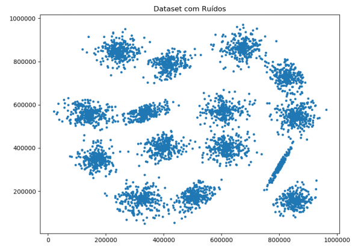
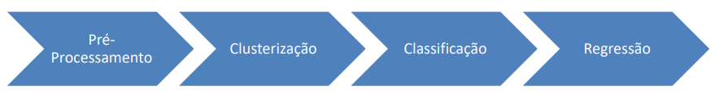

[TOC]

# MODELOS DE INTELIGÊNCIA ARTIFICIAL &amp; MACHINE LEARNING

Valor de pontos de cada exercício

| Exercício             | Pontuação |
| --------------------- | --------- |
| 1.1<br />1.2          | 0,6       |
| 2.1<br />2.2<br />2.3 | 0,9       |
| 3                     | 0,3       |
| 4                     | 0,4       |
| 5.1                   | 0,4       |
| 5.2                   | 1,25      |
| 6                     | 0,4       |
| 7                     | 1,5       |
| 8                     | 4,25      |

## 1 (0,6)

### 1.1 Desafio! Investigacion Papa Fresca (0,3)

Utilizando o arquivo **1.1_papafrescasimnao.csv** que é um recorte de teste deste projeto, descubra algumas regras de associação relacionadas ao consumo de batata, procure a relação de regras relacionadas ao questionamento da batata engordar ou não.

Dica: Procure utilizar uma confiança acima de 50% e verifique a quantidade de regras geradas antes de inspeciona-las.

### 1.2 Acidentes Policia Rodoviária Federal (0,3)

Utilizando o arquivo **1.2_acidentes-apriori.csv** que é um recorte da base de dados abertas dos acidentes de todas as rodovias federais, disponível de forma completa em: https://portal.prf.gov.br/dados-abertos-acidentes pela Polícia Rodoviária Federal. Procure analisar quais são as regras mais relevantes para análise de acidentes, tentem–se colocar no lugar no lugar de cientista de dados da polícia rodoviária, quais são as regras relevantes? Existem itemsets pouco relevantes que poderiam ser descartados na análise? Realize alguns filtros nos itemsets para facilitar a análise das regras geradas.

## 2 (0,9)

### 2.1 (0,3)

Utilizando o arquivo **2.1_usuarios-tempomedioquantidade.csv**, que é uma amostra do tempo de utilização dos usuários em um determinado sistema, faça a clusterização utilizando k-means e DBSCAN.

​	a) O que representam os clusters gerados?

​	b) Qual é a melhor quantidade de Clusters?

​	c) Qual é a melhor técnica (k-means ou DBSCAN) a ser utilizada nessa clusterização?

### 2.2 (0,3)

Utilizando dataset do arquivo **2.2_circulos.csv** faça a clusterização utilizando k-means e DBSCAN. Faça a plotagem da clusterização gerada (com cores diferentes para cada cluster).

​	a) Qual é a melhor quantidade de Clusters?

​	b) Qual é a melhor técnica (k-means ou DBSCAN) a ser utilizada nessa clusterização?

### 2.3 (0,3)

Utilizando o exemplo visto em sala com o dataset **2.3_cc-general.csv**, aplique o algoritmo DBSCAN e tente construir uma busca de parâmetros para calibrar o min_samples e o eps. Faça a plotagem da clusterização gerada (com cores diferentes para cada cluster).

a) Qual é a melhor quantidade de Clusters utilizando o método silhueta?

b) Qual é a melhor técnica (k-means ou DBSCAN) a ser utilizada nesse conjunto de dados?

## 3 (0,3)

Utilizando o dataset **3_zoo.csv** (disponível no repositório da disciplina), faça a classificação de todas as amostras dos animais presentes. Avalie a precisão, a acurácia e o melhor ‘k’ para este problema.

Dica, para ler o arquivo csv utilize o seguinte comando: zoo = pd.read_csv(‘c:/caminhodoarquivo/zoo.csv', engine='python')

## 4 (0,4)

Utilizando o dataset Heart Disease UCI (disponível no repositório da disciplina **4_heart.csv** e em https://www.kaggle.com/ronitf/heart-disease-uci) construa uma arvore de decisão que classifique as amostras em saudáveis (coluna target =0) ou não.

Avalie a precisão, acurácia e mostre a arvore de decisão gerada.

Existem um ou mais dados categóricos que precisam do devido tratamento. Para exibir a arvore de decisão utilize os comandos: 

- Instale o graphviz disponível em: https://graphviz.gitlab.io/_pages/Download/Download_windows.html

  ```python
  from sklearn.externals.six import StringIO
  from IPython.display import Image
  from sklearn.tree import export_graphviz
  
  import pydotplus
  import os
  
  os.environ['PATH'].split(os.pathsep)
  os.environ['PATH'] += os.pathsep + 'C:\\Program Files (x86)\\Graphviz2.38\\bin'
  
  dot_data = StringIO()
  
  export_graphviz(modeloTreinadoDT, out_file=dot_data,
      filled=True, rounded=True,
      feature_names = [vetor com o nome das features],
      class_names = [Saudável', ‘Doente'],
      special_characters=True)
  
  graph = pydotplus.graph_from_dot_data(dot_data.getvalue())
  Image(graph.create_png())
  ```

  

## 5 (1,65)

### 5.1 (0,4)

Utilizando o exemplo visto com o SVM e o dataset Titanic faça um GridSearch para encontrar a melhor configuração de parâmetros, entre o tipo de Kernel, pré-processamento (StandardScalar e MinMaxScalar), Gamma e C.

Qual foi a melhor configuração que você encontrou? Qual a melhor acurácia?

Dica: 

- Observe a matriz de confusão para verificar se o classificar está conseguindo classificar dados das duas classes;
- Normalize os dados;

### 5.2 (1,25)

Utilizando o dataset Pulsar Star (**5.2_pulsar_stars.csv**) construa um classificador SVM que classifique as amostras em estrelas de nêutrons ou não.

Avalie a precisão, acurácia e varie o tipo de kernel e parâmetro C para este problema. (GridSearch é opcional mas recomendável).

Qual foi a melhor configuração que você encontrou?

Dica: 

- Observe a matriz de confusão para verificar se o classificar está conseguindo classificar dados das duas classes;
- Normalize os dados;

## 6 (0,4)

Utilizando o dataset Mushroom Classification (disponível no repositório da disciplina **6_mushrooms.csv** e em https://www.kaggle.com/uciml/mushroom-classification construa um classificador Naive Bayes (Gaussiano ou não) que classifique as amostras em cogumelos comestíveis ou não.

Avalie as características do problema para eliminar as que não agregam capacidade decisória ao classificador.

Avalie a precisão, acurácia do classificador. Verifique o tempo de execução.

## 7. Clusterização as avessas (1,7)

Observe o conjunto de dados abaixo:




Ele possui 2 dimensões e está disponível no diretório da disciplina como **7_clusterizacao.csv**

Utilizando as técnicas vistas em sala de aula, realize a melhor clusterização possível para esse conjunto.

Dicas:

- O conjunto possui muitos ruídos;

- É possível validar visualmente a clusterização dados que o conjunto possui apenas 2 dimensões.

## 8. Clusterização, Classificação e Regressão (4,25)

Você foi escolhido o melhor cientista de dados de sua empresa e agora terá que fazer um trabalho para o governo em um dataset secreto, onde não se sabe o que representam cada coluna.

O governo não sabe como classificar os registros desse conjunto, logo foi sugerido uma clusterização que dará origem as classes do problema para que quando novos registros forem adicionar a bases, estes sejam automaticamente classificados por um classificador previamente treinado.

Logo se a clusterização for ruim, isso poderá comprometer toda a classificação.

Adicionalmente o Governo também deseja um Regressor que a partir dele construirá um simulador web informando as características e o regressor treinado calculará uma saída contínua baseado na característica V2.



O que deve ser entregue: Um documento (.doc, .pdf ou notebook) explicando TODOS os passos da solução.

É permitido usar todas as técnicas vistas em sala de aula. Lembrando que são 3 principais componentes do trabalho:

- Clusterização 

- Classificação

- Regressão

O pré-processmanto dos dados é fundamental.

- Faça a plotagem da clusterização.

- Faça a plotagem da Matriz de confusão e analise os resultados.

- Faça a plotagem dos resultados encontrados com os regressores utilizados

O Conjunto de dados está disponível no repositório da disciplina com o nome **8_trabalhoex8.csv**